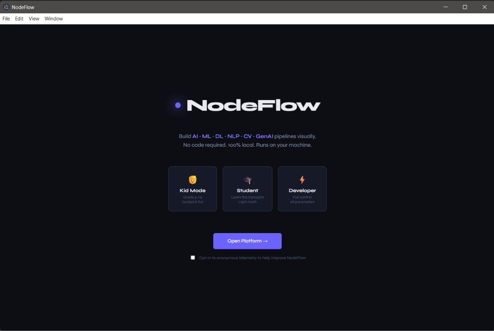
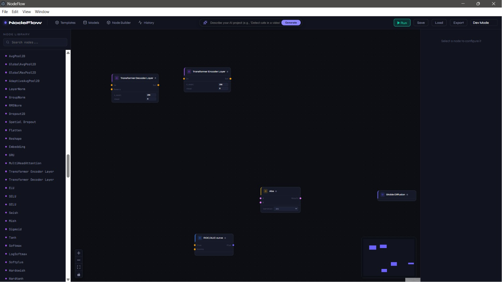

# 🌌 NodeFlow: Architecture & Overview

NodeFlow is a powerful, visually stunning desktop application designed for local-first AI and machine learning. Built for everyone from data scientists to students, it allows you to build complex AI pipelines using a drag-and-drop interface—**100% locally with zero cloud dependencies.**

## 📸 Interface Preview
<div align="center">
  
  <br/><br/>
  
  <br/><br/>
  
</div>

---

## 🚀 What NodeFlow Can Do

NodeFlow democratizes access to complex ML and AI workflows by turning code into visual, connectable nodes. 
- **Data Engineering:** Load CSVs, clean data, normalize, scale, and visualize distributions.
- **Classical ML:** Train random forests, SVMs, and XGBoost models for regression and classification tasks.
- **Deep Learning & GenAI:** Run state-of-the-art HuggingFace transformers, Stable Diffusion, and YOLO object detection right on your machine.
- **Python Export:** Instantly compile your visual node graph into a standalone, production-ready Python script that you can run anywhere.

> [!TIP]
> **Kid Mode**: A built-in toggle that transforms technical jargon into simplified, analogy-based learning. Perfect for educational environments.

---

## 🌟 NodeFlow 2.0 Features (New!)

We've recently deployed the massive 2.0 architectural update, bringing bleeding-edge capabilities to the canvas:
- **Inline Python Execution:** Write custom, arbitrary Python scripts directly inside nodes on the canvas. The backend uses `RestrictedPython` to safely parse and execute your logic without needing to build a custom node.
- **Plugin Registry:** A built-in `/plugins` FastAPI endpoint and SQLite schema allowing for hot-reloading community-developed nodes (like Medical Imaging or Crypto Trading packs).
- **Macro Nodes:** Support for visually collapsing massive sub-graphs into a single, clean node block.
- **Advanced Nodes Scaffolded:** The UI now supports dragging and dropping **Webcam Streams**, **3D Visualizers**, **Whisper Microphones**, **RAG Retrievers**, and **Cloud Burst Targets**.

---

## 🧩 Node Library Scale

NodeFlow currently features a massive built-in library of **241 distinct nodes** organized into **14 functional categories**, allowing for nearly infinite combinations of ML architectures:
1. **Foundations & Math** (Vector ops, matrix decomposition)
2. **Data Engineering** (CSVs, scaling, manipulation)
3. **Classical ML** (Scikit-learn classifiers, regressors)
4. **DL Fundamentals** (PyTorch neural network layers)
5. **Computer Vision** (Image processing, convolutions)
6. **Sequence & NLP** (Tokenizers, RNNs, LSTMs)
7. **Generative Models** (HuggingFace Transformers, Diffusers)
8. **Probabilistic & Bayesian** (Distributions, Markov models)
9. **Advanced Architectures** (Attention mechanisms, specialized networks)
10. **Evaluation & Interpretability** (Loss curves, metrics, SHAP)
11. **MLOps & Production** (Model export, monitoring)
12. **Specialty Domains** (Audio, Reinforcement Learning)
13. **Optimization & Scale** (Hardware tuning, ONNX)
14. **Kids Corner** (Gamified, simplified versions of complex concepts)

---

## ⚙️ The Dynamic Engine ("The Bridge")

At the core of NodeFlow is a highly efficient architecture known as **"The Bridge"**. 

Because JavaScript (Electron/React) is not suited for heavy ML computations, NodeFlow uses a hybrid dual-process engine:
1. **The UI Process:** The React frontend handles the rendering of the node graph (via XYFlow) and captures user input.
2. **The Execution Process:** A high-performance Python engine is spawned as a local subprocess by Electron in the background.

**The Bridge Connection:** The React frontend and the Python backend communicate continuously via a **real-time WebSocket connection**. When you click "Run", the UI serializes the node graph into a JSON DAG (Directed Acyclic Graph) and sends it across the Bridge. The Python engine performs a topological sort, executes the nodes using optimized C/C++ backed libraries (PyTorch/NumPy), and streams the logs, errors, and output tensors back across the Bridge in real-time.

> [!IMPORTANT]
> This architecture ensures that the UI remains completely fluid and responsive, even when training a massive neural network in the background.

---

## 🆚 Comparison to Other Tools

| Feature | NodeFlow | ComfyUI | Node-RED | Alteryx |
| :--- | :--- | :--- | :--- | :--- |
| **Primary Focus** | General ML, AI, & Data | Stable Diffusion / Image Gen | IoT & API Wiring | Enterprise Data Prep |
| **Execution Environment** | 100% Local Desktop | Local Browser UI | Local/Server | Cloud/Server |
| **Hardware Acceleration** | Auto-CUDA / Apple MPS | Auto-CUDA | N/A | Proprietary |
| **Cost** | Free & Open Source | Free & Open Source | Free & Open Source | Highly Expensive |
| **Target Audience** | Data Scientists, Students | AI Artists | IoT Engineers | Enterprise Analysts |

---

## 🛠️ Technology Stack

NodeFlow leverages a bleeding-edge modern stack across both its frontend and backend.

### Frontend
- **Framework:** React 19 + TypeScript
- **Container:** Electron (Desktop wrapper)
- **Node Graph:** XYFlow (React Flow)
- **Build System:** Vite & Electron Forge
- **Styling:** Vanilla CSS (Glassmorphism, vibrant gradients, custom UI components)

### Backend
- **Core Engine:** Python 3.9+
- **API & Bridge:** FastAPI + Uvicorn + Websockets
- **Classical ML:** Scikit-learn, XGBoost, LightGBM, Pandas, NumPy
- **Deep Learning:** PyTorch, Torchvision
- **Generative AI:** Transformers (HuggingFace), Diffusers, Ultralytics (YOLO)

---

## 🔄 Data and Logic Flow

The lifecycle of a single execution in NodeFlow looks like this:

1. **User Interaction:** The user drags nodes onto the canvas and connects output ports to input ports.
2. **Serialization:** The frontend `useBackend` hook takes the React Flow state and compiles it into a standard JSON graph payload.
3. **Transmission:** The JSON is sent over the local WebSocket to `ws://localhost:XXXX/ws`.
4. **Graph Parsing:** The Python FastAPI server receives the graph. The `NodeFlowEngine` validates the connections and uses Kahn's algorithm for **Topological Sorting** to determine the correct execution order (resolving dependencies).
5. **Execution:** Python loops through the sorted nodes. It pulls data from the output cache of parent nodes and passes it into the current node's compute function.
6. **Streaming Results:** As each node finishes, its execution time, status, and preview data (e.g., base64 images, JSON tables) are streamed back to the frontend.
7. **Rendering:** React receives the WebSocket messages and updates the state of specific nodes to show validation badges, port highlights, and result inspectors.

---

## 📁 Detailed Project Repository Structure

```text
k:\plaid\nodeflow-app\
├── .eslintrc.json           # ESLint configuration (warnings suppressed for strict types)
├── package.json             # NPM scripts and Node dependencies
├── forge.config.ts          # Electron build pipeline configuration
├── README.md                # Project landing page and setup guide
└── src/                     # Source Code Root
    ├── App.tsx              # Main React application and layout
    ├── index.css            # Global CSS, Design System, and Glassmorphism variables
    ├── main.ts              # Electron Main Process (Spawns Python subprocess)
    ├── preload.ts           # Electron IPC bridge
    ├── renderer.tsx         # React DOM mount point
    │
    ├── components/          # React UI Components
    │   ├── BaseNode.tsx     # The core wrapper component for all visual nodes
    │   ├── ChatNode.tsx     # Custom UI for LLM interactions
    │   ├── Inspector.tsx    # Right-side panel for viewing node output data
    │   ├── CodeEditor.tsx   # Integrated monaco-style code viewer for Python export
    │   ├── LossCurveNode.tsx# Custom UI for plotting training loss
    │   ├── NodeLibrary.tsx  # Left-side panel for dragging new nodes
    │   └── StatusBar.tsx    # Bottom status indicator (GPU/CPU, connection state)
    │
    ├── data/                
    │   └── nodeTemplates.ts # The master dictionary of all node definitions, ports, and Kid Mode analogies
    │
    ├── hooks/
    │   └── useBackend.ts    # Custom React hook managing the WebSocket state machine
    │
    └── backend/             # Python Execution Engine Subprocess
        ├── requirements.txt # Python dependency list (TensorFlow, PyTorch, etc.)
        ├── main.py          # FastAPI Server, Graph Engine, and WebSocket Handler
        ├── tests/           # Pytest suite verifying security and node logic
        └── nodes/           # Python implementation of node computations
            ├── cv_nodes.py         # Computer Vision (OpenCV)
            ├── data_nodes.py       # Data Loading, Pandas manipulation, Plotting
            ├── dl_nodes.py         # Deep Learning primitives (PyTorch layers)
            ├── genai_nodes.py      # LLMs, Stable Diffusion
            ├── math_nodes.py       # Tensors, Math ops
            ├── ml_nodes.py         # Scikit-learn, XGBoost models
            ├── nlp_nodes.py        # Tokenizers, Text processing
            └── specialty_nodes.py  # Audio, reinforcement learning
```
